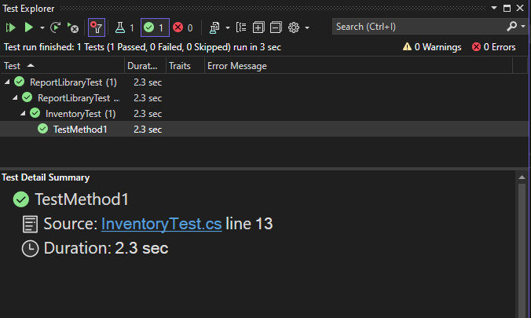

# Dynamic Report-building Class Library :handshake:
___
## Introduction
A dynamic report-building class library with these formats: Excel, Pdf, HTML and Markdown.
## Technology Stack
- It uses C# based on reflection to read attributes of a class, access type members, and execute methods.
- It uses the advanced topics of Microsoft's technology document reference: Native interoperability (COM interop programming).
## Output formats released
### An Excel spreadsheet with two options
- Without dynamic (uses strongly typed code to generate an Excel report).
- With dynamic (uses dynamic code to generate an Excel report).
### PDF (Coming soon)
### HTML (Coming soon)
### Markdown (Coming soon)
## Usage / Testing
  
## Reference
- [Access Office interop objects](https://learn.microsoft.com/en-us/dotnet/csharp/advanced-topics/interop/how-to-access-office-interop-objects)
- [C# Cookbook](https://learning.oreilly.com/library/view/-/9781492093688/)
